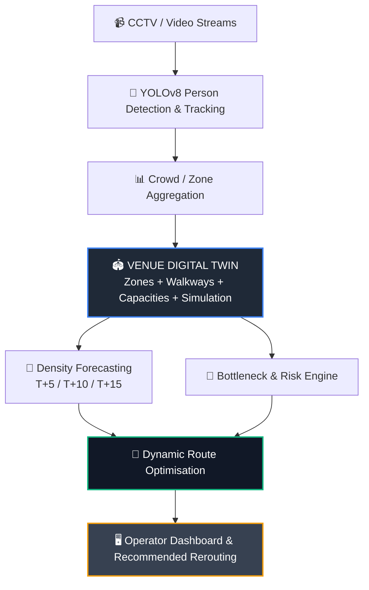
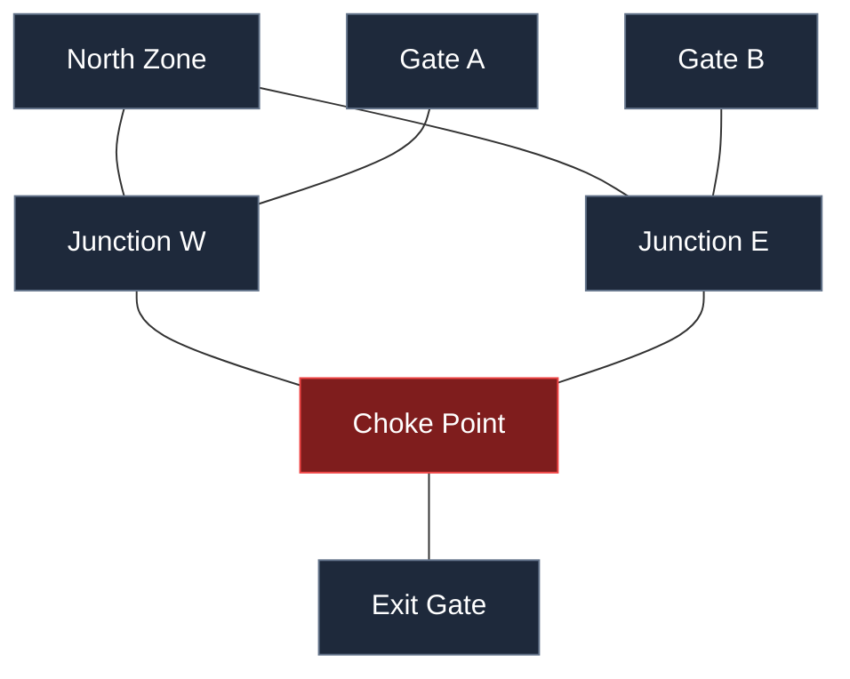
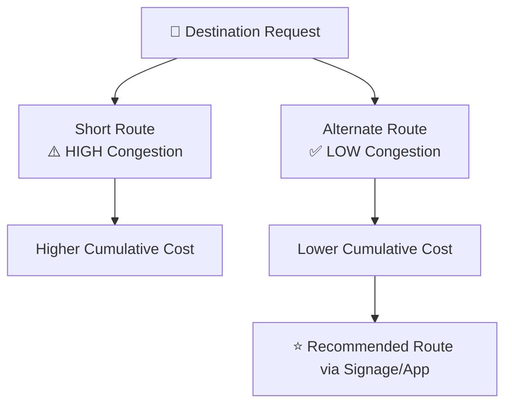
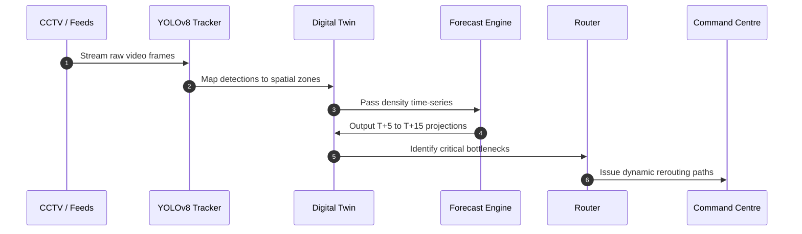
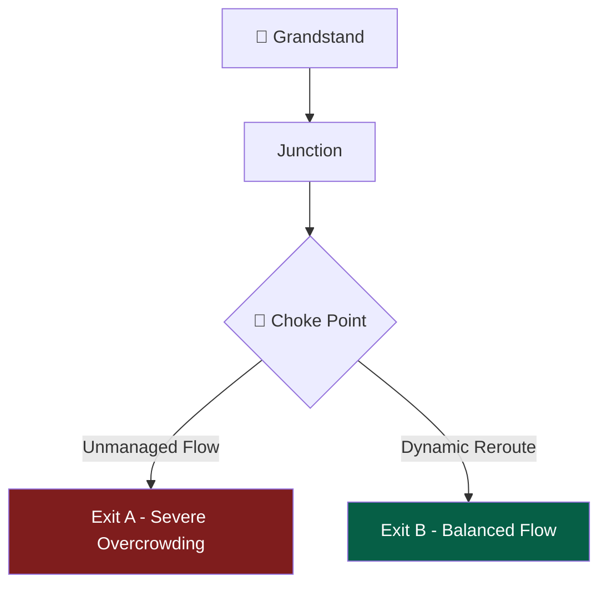
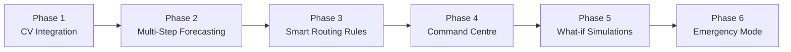

# 🏁 F1 Stadium Crowd Flow Optimiser

> **Real-time crowd simulation, bottleneck forecasting, and dynamic rerouting for high-density venues.**


An AI-assisted crowd management system designed for stadiums, motorsport venues, festivals, railway stations, and other high-density public events.

The project combines **computer vision**, **crowd-density analysis**, a **venue digital twin**, **capacity-aware crowd simulation**, **bottleneck forecasting**, and **dynamic route optimisation** to help event operators identify dangerous crowd build-ups *before* they become critical and guide people toward safer, less congested paths.

> [!NOTE]
> **Hackathon Problem Statement:** Crowd Flow Optimiser — *Simulating and rerouting crowds in real time.*

---

## 🎯 Problem

Large venues frequently experience dangerous crowd concentrations around critical choke points:

* Entry and exit gates
* Narrow walkways and corridors
* Food and concession areas
* Junctions & intersections
* Grandstands and spectator zones
* Emergency exits

Traditional monitoring is inherently **reactive**: an operator observes an area that is already crowded and then responds.

### Paradigm Shift

```text
FROM: "Where is the crowd right now?"
TO:   "Where is the crowd likely to become dangerous, when will it happen, and what should we do NOW?"

```

---

## 💡 System Architecture

The system is designed around a closed-loop crowd-management pipeline:



---

## 🚀 Current Capabilities

The repository consists of two core layers:

### 1. Existing Computer-Vision Modules

* 👥 **Real-time person detection**
* 🎯 **YOLOv8-based tracking**
* 📊 **Crowd counting**
* 🔥 **Grid-based density mapping**
* 🚨 **Crowd threshold alerts**
* 🧭 **Multi-route crowd analysis**
* 🛣 **Route recommendation**
* 🔊 **Voice guidance**
* 📈 **Interactive visualisations**
* 🧠 **Crowd movement & behaviour analysis**

### 2. GrandPrix Crowd Intelligence Engine

The `grandprix/` package adds the predictive and simulation layer:

* 🗺️ **Venue graph / digital-twin representation**
* 👥 **Capacity-aware crowd simulation**
* 📈 **Online density forecasting**
* 🚨 **Bottleneck risk classification**
* 🧭 **Density-aware A* routing**
* 🔀 **Dynamic rerouting**
* 🌐 **FastAPI control plane**
* 🧪 **Automated test suite**
* 🎮 **Reproducible simulation demo**

---

## 🧠 GrandPrix Engine Structure

The core intelligence engine resides in:

```bash
grandprix/
├── __init__.py
├── core.py         # Digital twin, simulation, forecasting, routing
├── api.py          # FastAPI control plane & endpoints
├── forecasting.py  # Trend analysis & predictive models
└── demo.py         # End-to-end simulation demo

```

---

## 🗺️ Digital Twin Representation

The venue is represented as a spatial network graph where physical spaces are mapped into interconnected nodes and edges:



### Data Specifications

| Component | Attributes Tracked |
| --- | --- |
| **Zones / Nodes** | Maximum Capacity, Current Population, Predicted Population, Risk Level |
| **Walkways / Edges** | Physical Distance, Flow Capacity, Travel Cost, Congestion Pressure |

---

## 🔮 Bottleneck Forecasting

Instead of only reacting to current crowd density, the engine projects future density from recent observations.

The baseline prototype uses an interpretable forecasting approach:

* **Exponentially weighted density history**
* **Instantaneous trend detection**
* **Capacity-aware risk thresholds**

The forecasting interface is modular, allowing seamless upgrades to machine learning models:

* 🌲 **XGBoost / LightGBM**
* 📈 **Temporal Regression**
* 🔄 **LSTM / GRU Neural Networks**
* ⚡ **Temporal Transformers (Hugging Face)**

---

## 🚨 Bottleneck Risk Classification

Predicted density is continually mapped into four operational risk tiers:

$$\text{NORMAL} \longrightarrow \text{WARNING} \longrightarrow \text{CRITICAL} \longrightarrow \text{EMERGENCY}$$

The system prioritises and ranks problematic zones for operator triage:

| Zone Name | Current Density | Predicted Risk Level | Action Priority |
| --- | --- | --- | --- |
| **Main Choke** | 88% | 🔴 `EMERGENCY` | Immediate Reroute |
| **West Junction** | 72% | 🟠 `CRITICAL` | Pre-emptive Alert |
| **Gate B** | 55% | 🟡 `WARNING` | Monitor Inflow |
| **North Corridor** | 20% | 🟢 `NORMAL` | Clear |

---

## 🧭 Dynamic Rerouting Engine

The routing algorithm calculates optimal paths by balancing distance against real-time and predicted congestion using a cost function:

$$\text{Cost} = \text{Distance} + f(\text{Current Congestion}) + g(\text{Capacity Pressure}) + h(\text{Predicted Density})$$



---

## 🎥 Computer Vision Pipeline Summary

The repository includes CV components that feed real-world data into the GrandPrix engine:

* **Crowd Behaviour Analysis:** Detection, tracking, movement vectors, speed estimation, trajectory mapping.
* **Crowd Alert System:** Real-time head counts with automatic threshold notifications.
* **Grid Density Mapper:** Spatial heatmap overlay dividing camera feeds into actionable zones.
* **Route Planner:** Multi-path travel time estimation and audio/visual guidance.

---

## 🌐 API Overview

The GrandPrix engine provides a **FastAPI** control plane:

| Method | Endpoint | Purpose |
| --- | --- | --- |
| `GET` | `/health` | Service health status |
| `GET` | `/state` | Full state of the venue digital twin |
| `POST` | `/ingest` | Ingest real-time camera observations |
| `POST` | `/spawn` | Add simulated agents to the venue |
| `POST` | `/step` | Advance the simulation time step |
| `GET` | `/forecast` | Retrieve predicted spatial densities |
| `POST` | `/reroute` | Calculate dynamic rerouting paths |
| `GET` | `/graph` | Export the venue structural graph |

> [!TIP]
> Interactive Swagger UI documentation is available at `http://127.0.0.1:8001/docs` after launch.

---

## ⚙️ Installation

```bash
# 1. Clone repository
git clone [https://github.com/HimanshuPathak2725/Crowd-Management-system.git](https://github.com/HimanshuPathak2725/Crowd-Management-system.git)
cd Crowd-Management-system

# 2. Setup virtual environment
python3 -m venv .venv
source .venv/bin/activate  # On Windows: .venv\Scripts\activate

# 3. Install GrandPrix Engine dependencies
pip install -r requirements-grandprix.txt

```

---

## ▶️ Execution

### Run the Simulation Demo

```bash
python -m grandprix.demo

```

*Output Example:*

```text
t=  5.0s agents=120 rerouted=120
worst=[('choke', 'EMERGENCY', ...)]
→ 120 dynamic reroutes executed successfully.

```

### Run the Control API

```bash
python -m grandprix.api

```

### Run Automated Tests

```bash
python -m pytest -q

```

---

## 📊 End-to-End System Workflow



---

## 🏆 Closed-Loop Crowd Intelligence

Most existing tools rely on basic reactive monitoring:


$$\text{Detect} \longrightarrow \text{Count} \longrightarrow \text{Alert}$$

Our system completes the proactive feedback loop:


---

## 🏁 Example F1 Scenario

### Post-Race Grandstand Egress

When tens of thousands of fans leave a grandstand simultaneously:



* **Without Intervention:** Density spikes exponentially at Exit A, leading to critical risk warnings.
* **With Prediction + Rerouting:** The engine forecasts the choke point 10 minutes in advance and diverts incoming crowds toward Exit B before severe congestion builds.

---

## 🔬 Planned Roadmap



* **Phase 1 — Homography & Calibration:** Direct mapping of bounding boxes to world coordinate maps.
* **Phase 2 — Multi-Step Forecasting:** Confidence intervals and uncertainty bounds for T+15 targets.
* **Phase 3 — Routing Stability:** Hysteresis logic, cooldown timers, and flow balancing.
* **Phase 4 — Command Centre UI:** Integrated 3D/2D digital twin dashboard with live heatmaps.
* **Phase 5 — Scenario Testing:** Operator sandbox for simulating unexpected gate closures or crowd surges.
* **Phase 6 — Emergency Evacuation:** Safe exit distribution and active flow suppression logic.

---

## 📈 Key Performance Metrics

| Metric | Target | Focus |
| --- | --- | --- |
| **Peak Zone Density** | 📉 Decrease | Safety |
| **Average Travel Time** | 📉 Decrease | Efficiency |
| **Critical Bottleneck Duration** | 📉 Decrease | Risk Mitigation |
| **Prediction MAE** | 📉 Decrease | Forecast Accuracy |
| **Warning Lead Time** | 📈 Increase | Early Intervention |
| **Evacuation Completion Time** | 📉 Decrease | Emergency Response |

---

## 🤗 Hugging Face Integration

This system leverages Hugging Face infrastructure for:

* **Time-series Transformer models** for crowd flow prediction.
* **Multimodal vision-language models** for automatic scene assessment.
* **Model hosting & evaluation pipelines** to continuously benchmark forecasting accuracy.

---

## 🛠 Tech Stack

* **Computer Vision:** `Python`, `YOLOv8 (Ultralytics)`, `OpenCV`, `NumPy`
* **Crowd Intelligence:** `NetworkX`, Graph Modeling, Custom A* Routing Algorithms
* **Backend API:** `FastAPI`, `Pydantic`, `Uvicorn`
* **Visualisation:** `Gradio`, `Plotly`, `Matplotlib`
* **ML / AI Infrastructure:** `Hugging Face Hub`, `PyTorch`, `Scikit-learn`
* **Testing:** `Pytest`

---

## 📁 Repository Structure

```text
Crowd-Management-system/
├── CROWD ALERT SYSTEM/
├── GRID DENSITY MAPPER/
├── Temple route planner/
├── crowd behaviour analysis/
├── grandprix/
│   ├── __init__.py
│   ├── api.py
│   ├── core.py
│   ├── forecasting.py
│   └── demo.py
├── tests/
│   └── test_grandprix.py
├── GRANDPRIX_ENGINE.md
├── requirements-grandprix.txt
└── README.md

```

---

## 👨‍💻 Author

**Himanshu Pathak**

*B.Tech — Computer Science & Engineering*

🔗 **GitHub:** [@HimanshuPathak2725](https://github.com/HimanshuPathak2725)

---

## 📜 License

Distributed under the **MIT License**. See `LICENSE` for more information.

> *"Don't wait for the crowd to become dangerous. Predict where it will happen, simulate the consequences, and reroute people before the bottleneck forms."*
